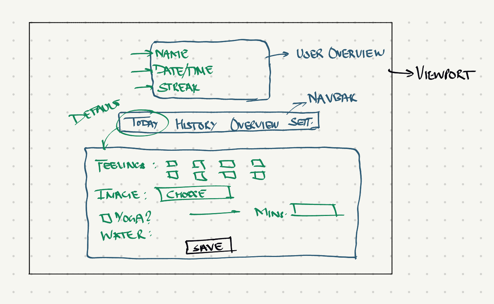
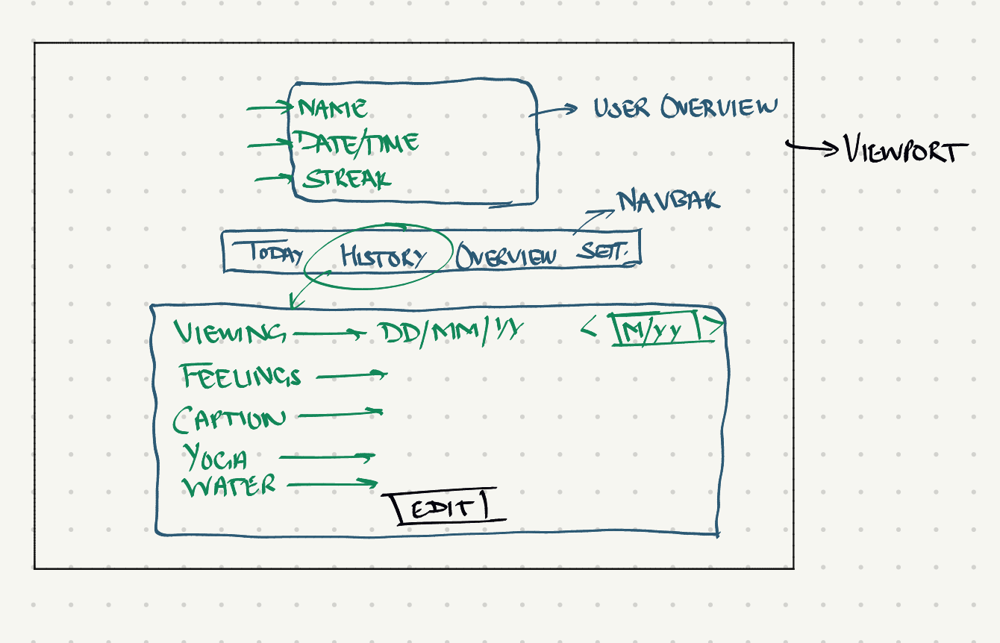
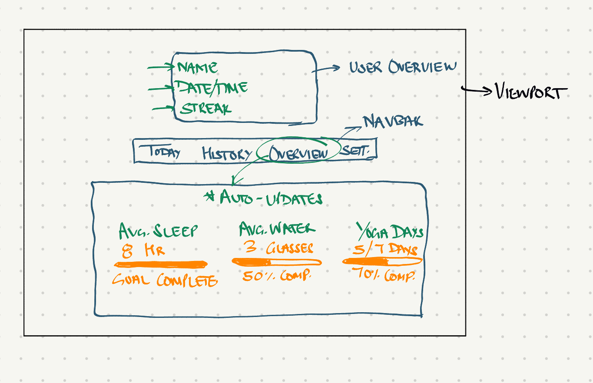
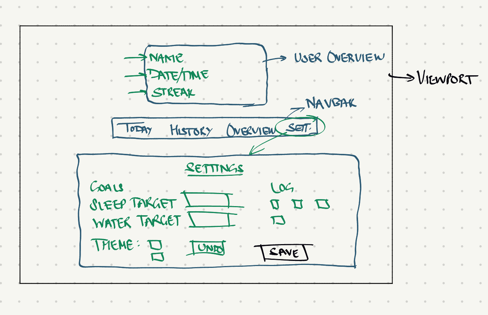
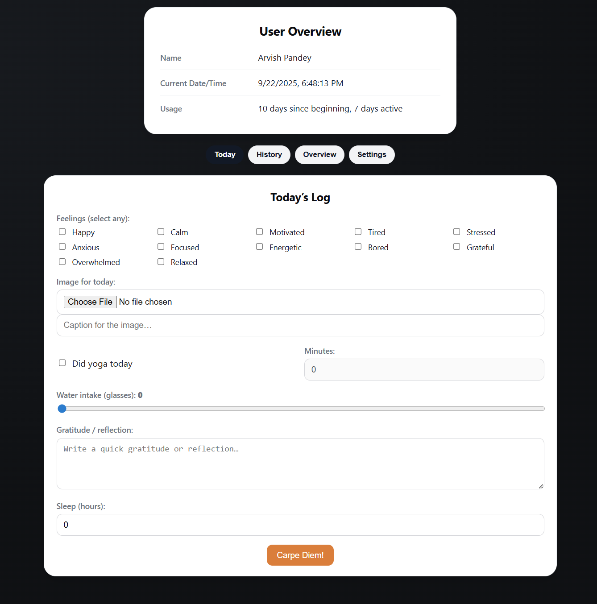
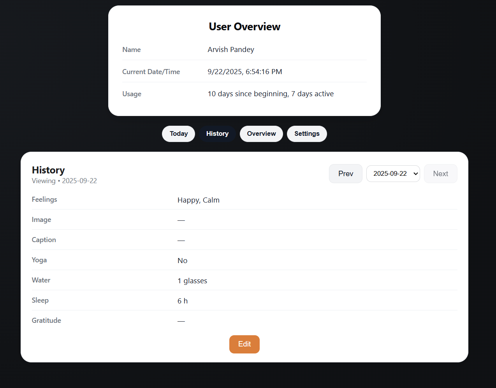

# P1 - Arvish’s Tracker — Goal Tracking & Journaling UI for User Interface

This template should help get you start.

---

## 📖 Project Description

This is an interactive journaling and goal-tracking interface built with Svelte. The application allows users to log daily activities such as sleep, water intake, yoga, reflections, and moods, while also providing summaries and visual overviews of progress toward personal goals.

This project was created as part of a User Interface Design course and emphasizes UI clarity, consistency, and user-centered design principles.

---

## 📝 Design Process

- **Interviewing**:
To shape the design, I conducted short peer interviews with fellow students and friends. A few key needs emerged:
  - Ability to quickly log core activities (sleep, water, moods).
  - Desire for reflective prompts (gratitude, journaling).
  - Preference for simple visuals to see progress without reading too much text.
  - Interest in customization (choosing what to log, adjusting themes).

- **Sketching**:
Initial sketches explored card-based layouts vs. scrolling dashboards. Based on peer feedback:
  - I chose a tabbed interface (“Today”, “History”, “Overview”, “Settings”) for clarity.
  - Daily logging was designed as a single card with multiple input types (checkboxes, ranges, text, file upload).
  - Overview was simplified into three core metrics (sleep, water, yoga).

- **Feedback**:
I showed early sketches and a mid-prototype to classmates. Feedback included:
  - “Make it clear when I saved something” → added visual feedback after logging.
  - “History should be editable” → implemented entry editing.
  - “Themes would be cool” → allowed switching between orange and blue themes.

---

## 🖥️ Interface Features

### Daily Logging (Today tab)

- Feelings: Choose from 12 mood options via checkboxes.
- Image + Caption: Upload an image of the day with optional caption.
- Yoga: Log whether yoga was done and minutes practiced.
- Water: Range slider for number of glasses.
- Gratitude / Reflection: Text area for journaling.
- Sleep: Numeric entry for hours slept.
- Save button: Provides instant feedback (“Saved ✓”) with timestamp.

### Entry History (History tab)

- View past entries in chronological order.
- Navigate via previous/next buttons or dropdown.
- Edit entries directly (update feelings, sleep, water, etc.).
- Clear visual distinction between view and edit modes.

### Overview (Overview tab)

- Average sleep (with % toward sleep goal).
- Average water intake.
- Count of yoga days.
- Each metric is paired with simple progress bars for at-a-glance feedback.

### Settings (Settings tab)

- Customize which activities to log (enable/disable).
- Update personal goals (sleep hours, water glasses, yoga minutes).
- Switch between orange and blue theme; undo option included.
- Clear feedback when settings are saved.

---

## 🏗️ Implementation

- **Framework**: Svelte with Vite.
- **Structure**:
  - App.svelte — root with tab navigation.
  - lib/DayLog.svelte — daily logging interface.
  - lib/EntryHistory.svelte — previous entries.
  - lib/Overview.svelte — summaries.
  - lib/Settings.svelte — customization & goals.
  - lib/stores/entries.js — store with mock entries, update logic.
  - lib/stores/preferences.js — user preferences, themes.
- **Styling**: Custom CSS with a desktop-first layout (optimized for ~1280px width).
- **Style Management**: Svelte stores (writable, derived) to hold entries and preferences.
- **Data**: Mock data provided for past entries; all new logs update the same array.

---

## 📸 Screenshots

---

## 🤖 Use of AI
AI tool (ChatGPT) was used in a limited, fair-use capacity:
- **Strengths**: Helped debug syntax issues, structure stores, and refine accessibility (labels, placeholders). Functioned like a classmate to bounce ideas off.
- **Limitations**: Did not generate final UI design — sketches, decisions, and customizations were mine. AI could not replace iterative feedback from peers, which directly shaped features like editable history and themes.
- **Reflection**: Using AI accelerated coding, but careful human oversight was required to adapt the output to class goals and maintain a personal design voice.

---

## 🔮 Future Work
While Levels 1-3 addressed the core features, interviews suggested additional goals that weren’t implemented yet:
- Friend Syncing / Peer Sharing / Leaderboards
- Cross-Device Sync
- Additional Customization: Activity templates and User-Defined templates.
These would extend the application to feel more social and connected, while maintaining its simple, journal-first design.

--- 

## 🎥 Demo Video

---

## 🔗 Links

### Source Code - [Github](https://github.com/arvish/ui_project_1)
### [Live Application](https://eloquent-caramel-5ff110.netlify.app/)
